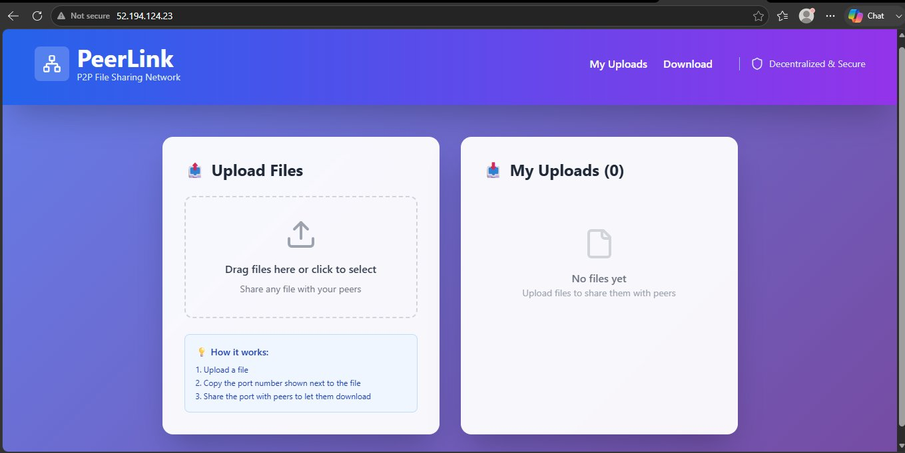
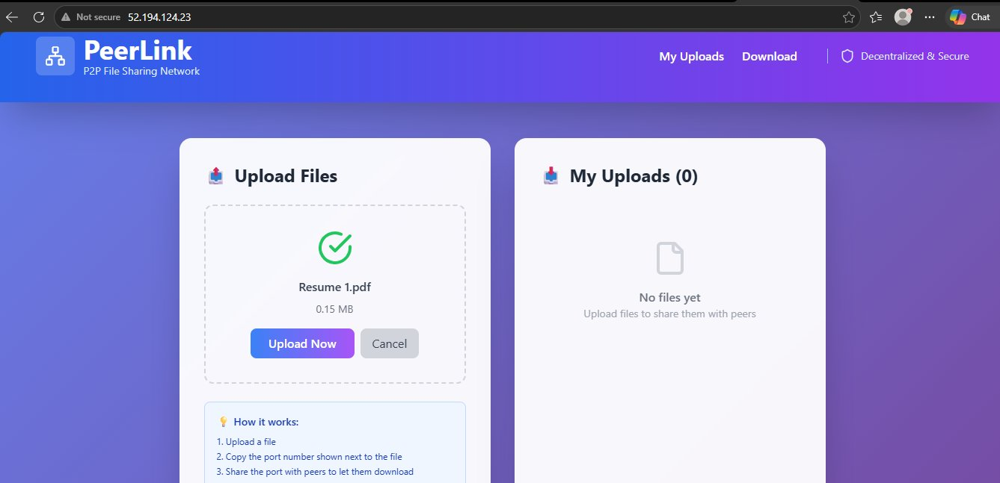
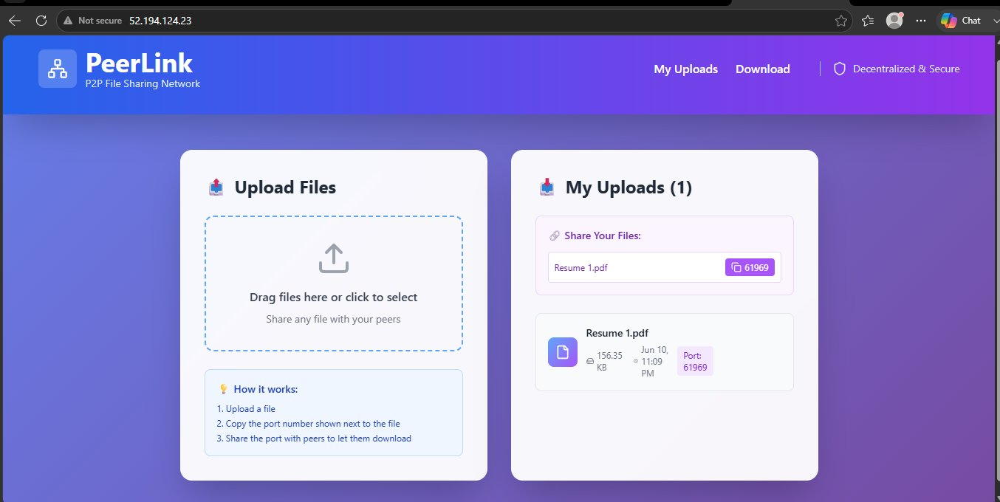
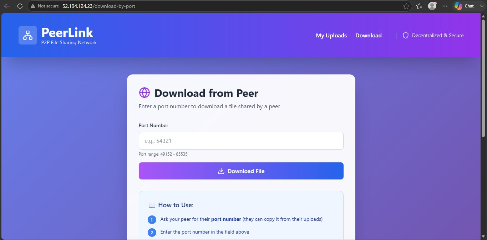
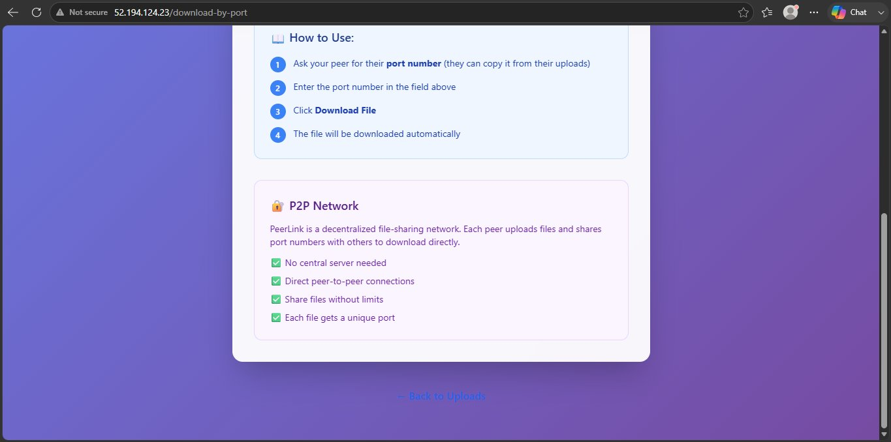

# 🔗 PeerLink — P2P File Sharing Network

<div align="center">


**Decentralized peer-to-peer file sharing — no central storage, no middleman.**

*Upload a file. Get a port. Share the port. Your peer downloads directly.*

🌐 **Live Demo:** [http://52.194.124.23](http://52.194.124.23)

</div>

---

## 📌 What Is PeerLink?

PeerLink is a **decentralized file sharing system** where files are never stored on a central server. Instead:

- Each uploaded file gets a **unique port number** (range: 49152–85535)
- The uploader shares this **port number** with their peer
- The peer enters the port number and **downloads directly**
- No cloud storage. No file size limits. No middleman.

> **The backend is a Java socket server — not Spring's HTTP layer.** Each file upload opens a real TCP socket on a dynamic port. The peer connects directly to that socket and streams the file bytes. This is raw socket programming in production.

---

## 🖥️ Application Screenshots

### Home Page — Upload Files

> Clean drag-and-drop interface. Left panel for uploading, right panel shows your active uploads with their assigned port numbers.

---

### File Selected — Ready to Upload

> File selected and ready. Shows file name and size before upload confirmation.

---

### File Uploaded — Port Assigned

> File uploaded successfully. **Port 61969** assigned automatically. Share this port with your peer to let them download.

---

### Download from Peer

> Peer enters the port number (49152–85535 range) and clicks Download File. Direct socket connection established to the uploader's file server.

---

### P2P Network — How It Works

> Fully decentralized — no central server needed, direct peer connections, each file gets a unique port.

---

## ⚙️ Architecture

```
                    ┌──────────────────────────────────┐
                    │         AWS LightSail VPS         │
                    │                                   │
  User Browser ────►│  Nginx (Port 80)                 │
                    │    │                              │
                    │    ├──► /api/*  ──► Backend :8080 │◄── Java Socket Server
                    │    │              (Spring Boot +  │    (Ports 49152-85535)
                    │    │               Socket Layer)  │
                    │    │                              │
                    │    └──► /*  ────► Frontend :3000  │
                    │              (Next.js)            │
                    └──────────────────────────────────┘
                              │
                    ┌─────────▼──────────┐
                    │   PM2 Process Mgr  │
                    │  - peerlink-backend│
                    │  - peerlink-frontend│
                    └────────────────────┘
```

### P2P File Transfer Flow:

```
Uploader                    Server                      Downloader
   │                           │                            │
   │── Upload File ───────────►│                            │
   │                           │ Opens TCP Socket           │
   │                           │ on Port 61969              │
   │◄── Returns Port 61969 ────│                            │
   │                           │                            │
   │   (Shares port with peer out-of-band)                  │
   │                           │                            │
   │                           │◄── Enter Port 61969 ───────│
   │                           │                            │
   │                           │── Stream File Bytes ──────►│
   │                           │   (Direct TCP Socket)      │
   │                           │                            │
   │                           │── Close Socket ────────────│
```

---

## 🛠️ Tech Stack

| Layer | Technology | Purpose |
|---|---|---|
| Backend | Java + Spring Boot | REST APIs + Socket server |
| Frontend | Next.js | Web UI |
| Networking | Java Sockets | P2P file transfer |
| Reverse Proxy | Nginx | Traffic routing + TLS termination |
| Containerization | Docker + Docker Compose | Service isolation |
| Process Manager | PM2 | Keep services alive |
| Cloud | AWS LightSail | VPS hosting |
| Port Range | 49152 – 85535 | Dynamic file ports |

---

## 🔧 Key Technical Decisions

### Why Raw Java Sockets?
```
Standard HTTP is request-response — not ideal for streaming large files.
TCP sockets give:
  → Direct byte-level streaming
  → No HTTP overhead per chunk
  → True peer connection (not proxied through server storage)
  → Each file isolated on its own port
```

### Why Nginx as Reverse Proxy?
```
AWS LightSail assigns one public IP.
Nginx routes:
  → Port 80 traffic to frontend (3000) or backend (8080)
  → Handles all incoming connections cleanly
  → Adds security headers (X-Content-Type, X-Frame-Options, XSS-Protection)
  → Single entry point for the entire application
```

### Why PM2?
```
Java JAR + Next.js need to stay alive on the server.
PM2:
  → Restarts processes on crash automatically
  → Starts on VPS reboot
  → Monitors both backend and frontend processes
```

---

## 🚀 Running Locally

### Prerequisites
```
- Java 17+
- Node.js 18+
- Maven
- Docker (optional)
```

### Option 1 — Docker Compose (Recommended)
```bash
git clone https://github.com/sumit-kumar-guptaa/PeerLink.git
cd PeerLink
docker-compose up --build
```

```
Frontend → http://localhost:3000
Backend  → http://localhost:8080
```

### Option 2 — Manual Setup

**Backend:**
```bash
cd PeerLink
mvn clean package
java -jar target/PeerLink-0.0.1-SNAPSHOT.jar
# Backend runs on http://localhost:8080
```

**Frontend:**
```bash
cd UI
npm install
npm run dev
# Frontend runs on http://localhost:3000
```

---

## ☁️ AWS LightSail Deployment

Full automated VPS setup script included:

```bash
# On your AWS LightSail instance:
git clone https://github.com/sumit-kumar-guptaa/PeerLink.git
cd PeerLink
chmod +x vps-setup.sh
./vps-setup.sh
```

**The script automatically:**
```
✅ Installs Java 17, Node.js 18, Nginx, Maven, PM2
✅ Clones and builds the project
✅ Configures Nginx as reverse proxy
✅ Starts backend + frontend with PM2
✅ Sets PM2 to auto-start on reboot
```

**Nginx Configuration (auto-configured):**
```nginx
server {
    listen 80;

    # Backend API
    location /api/ {
        proxy_pass http://localhost:8080/;
        proxy_set_header X-Real-IP $remote_addr;
    }

    # Frontend
    location / {
        proxy_pass http://localhost:3000/;
    }
}
```

**AWS LightSail Port Configuration:**
```
Open these ports in LightSail firewall:
→ Port 80    (HTTP — Nginx)
→ Port 8080  (Backend — optional, for direct access)
→ Port 3000  (Frontend — optional)
→ Port range 49152-65535 (P2P file transfer sockets)
```

---

## 📁 Project Structure

```
PeerLink/
├── src/                          ← Spring Boot backend
│   └── main/java/
│       ├── controllers/          ← REST API endpoints
│       ├── services/             ← File socket management
│       └── PeerLinkApplication.java
├── UI/                           ← Next.js frontend
│   ├── app/
│   │   ├── page.tsx              ← Home / Upload page
│   │   └── download-by-port/    ← Download page
│   └── package.json
├── screenshots/                  ← App screenshots
├── Dockerfile.backend            ← Backend Docker config
├── Dockerfile.frontend           ← Frontend Docker config
├── docker-compose.yml            ← Multi-service compose
├── vps-setup.sh                  ← AWS LightSail setup script
└── pom.xml                       ← Maven dependencies
```

---

## 🌐 Live Demo

> **URL:** [http://52.194.124.23](http://52.194.124.23)  
> **Hosted on:** AWS LightSail  
> **Reverse Proxy:** Nginx  

**Try it yourself:**
1. Open the URL in two different browser tabs
2. In Tab 1 — upload any file, note the port number
3. In Tab 2 — go to Download, enter the port number
4. File downloads directly — no central storage involved

---

## 👨‍💻 Author

**Sumit Kumar Gupta**  
Backend Developer | Distributed Systems | AWS | Core Java

[](https://www.linkedin.com/in/sumit-kumar-gupta-9b4970285/)
[](https://github.com/sumit-kumar-guptaa)
[](mailto:sumit.gupta.14486@gmail.com)

---

<div align="center">

*"No cloud. No central server. Just two peers and a port number."*

⭐ **Star this repo if you found it interesting!**

</div>
